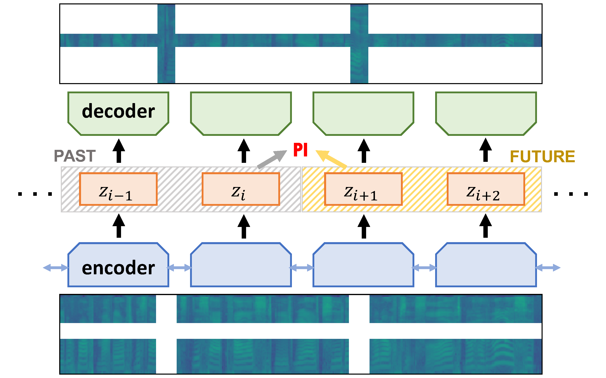
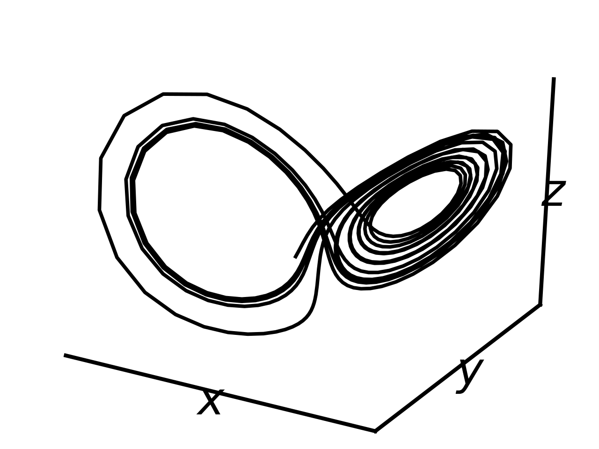
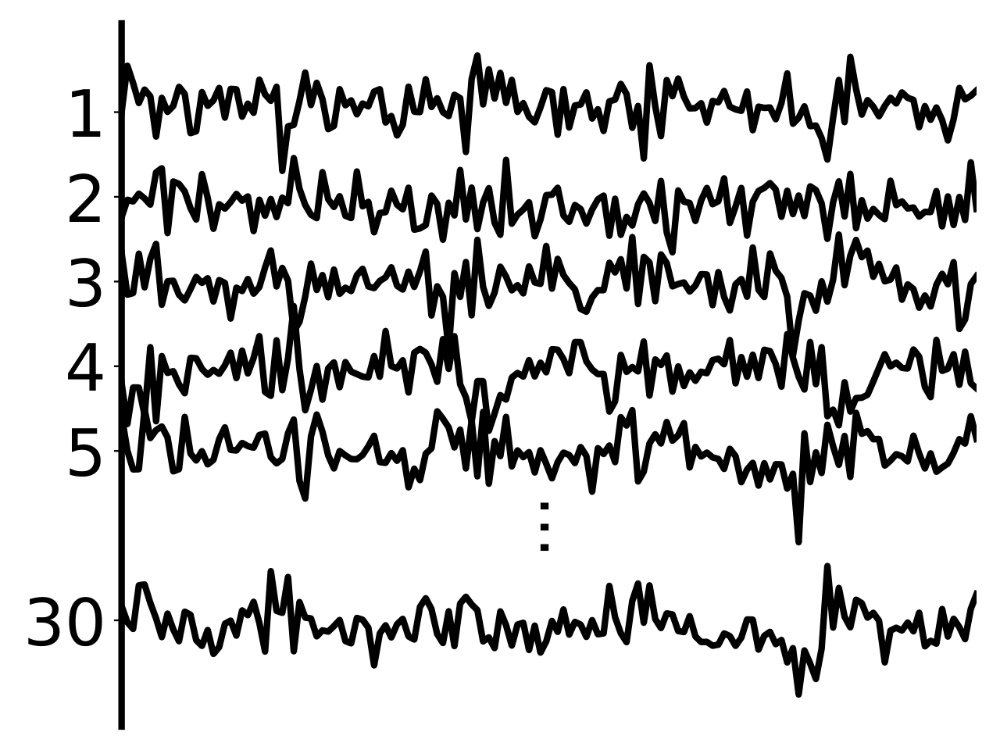
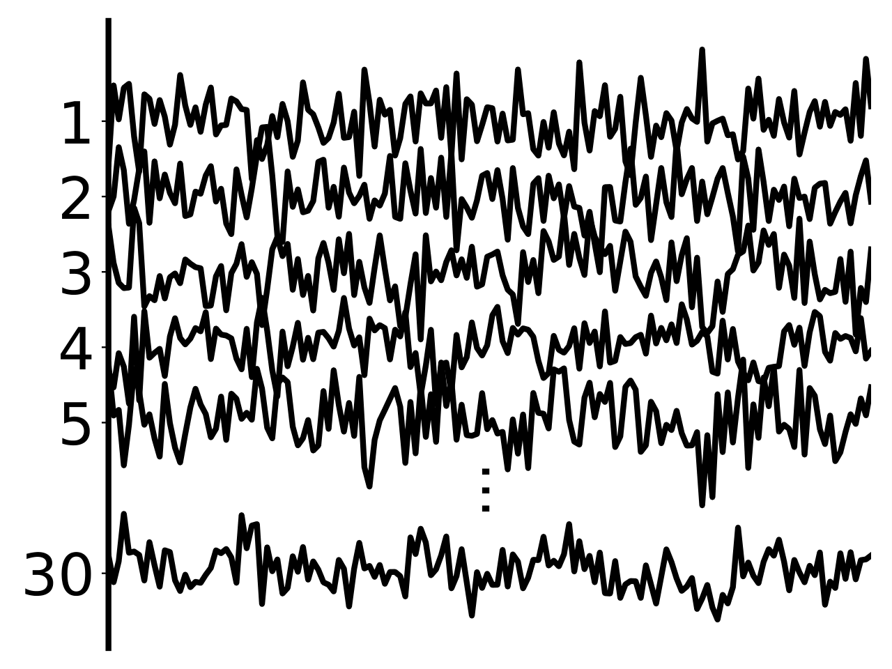
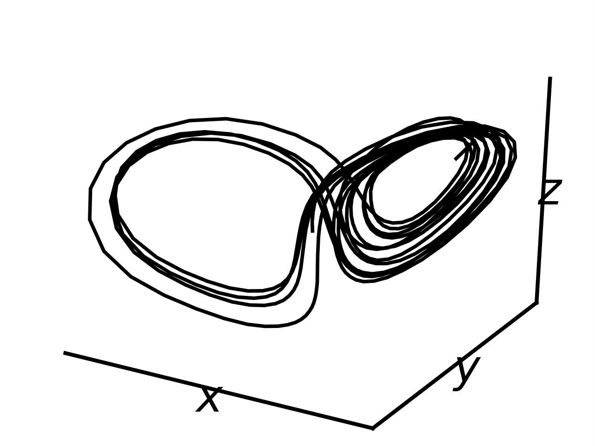

# Deep Autoencoding Predictive Components

### Overview

<div align=center></div>
Deep Autoencoding Predictive Components (**DAPC**) is a self-supervised representation learning method for sequence data, based on the intuition that useful representations of sequence data should exhibit a simple structure in the latent space. We encourage this latent structure by maximizing an estimate of *predictive information* of latent feature sequences, and regularize the learning through masked reconstruction. 

This repository mainly demonstrates the Lorenz Attractor experiments. 

<p float="middle">
  
   
  
  
</p>

Leftmost:  ground-truth 3d signals. Middle left: lifted 30d signals. Middle right: noisy lifted 30d signals. Rightmost: unsupervised recovery of the 3d signals by DAPC.

### Requirements

- Python 3.7+
- numpy 1.17.3
- matplotlib
- PyTorch 1.5.0

Older versions might work as well.

### Usage

Download the repo

```
git clone https://github.com/JunwenBai/DAPC.git
```

To run the deterministic DAPC

```
./run_ddapc.sh <gpuid>
```

To run the probabilistic DAPC

```
./run_vdapc.sh <gpuid>
```

`<gpuid>` is the gpu id of your machine. One can inspect the bashes to see all the options for training. 

### Paper

**Representation Learning for Sequence Data with Deep Autoencoding Predictive Components**

Junwen Bai, Weiran Wang, Yingbo Zhou, Caiming Xiong

[arXiv:2010.03135](https://arxiv.org/abs/2010.03135)

### References

Clark, David, Jesse Livezey, and Kristofer Bouchard. "Unsupervised Discovery of Temporal Structure in Noisy Data with Dynamical Components Analysis." Advances in Neural Information Processing Systems. 2019.

[DCA](https://github.com/BouchardLab/DynamicalComponentsAnalysis)
